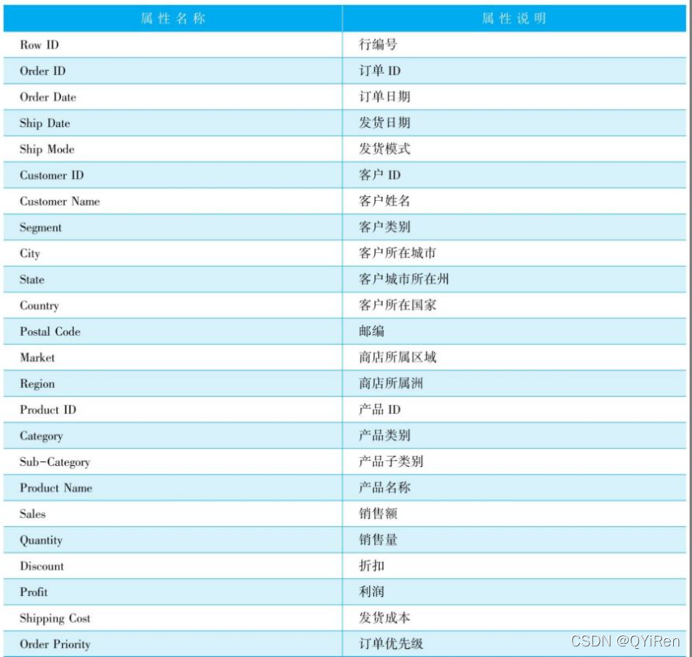

# 数据分析实战
## 1. 电商销售数据分析
   ### 1.1 背景
   随着电商平台的不断发展，网上购物几乎成为人们的首选。日益兴起的电商平台和逐渐没落的线下店铺形成了鲜明的对比。面对这些挑战，就需要能够及时发现店铺经营中的问题，并且能够有效解决这些实际的问题，从而提升自身的竞争力。
   根据已有数据对店铺整体运营情况进行分析，了解运营状况，对未来进行预测，已经成为电商运营必不可少的技能。
   ### 1.2 分析目标
   对一家全球超市4年（2018～2022年）的零售数据进行数据分析，分析目标如下：
   1. 根据所给的数据搭建完善的指标系统
   2. 分析每年销售额增长率
   3. 各地区分店的销售额
   4. 销售淡旺季对比
   5. 利用RFM模型标记用户价值


   ### 1.3 数据准备
   数据来源于数据科学竞赛平台Kaggle，网址为https://www.kaggle.com/jr2ngb/superstore-data，总共51290条数据，24个字段。详情见下超市数据属性表。
   
   ### 1.4 数据清洗
   #### 1.4.1 数据导入
   ```
      RawData = pd.read_csv("static/data/superstore_dataset2011-2015.csv", encoding="ISO-8859-1")
   ```

   * 数据导入的时候需要注意导入数据的类型以及是否需要索引列，分隔符等


   #### 1.4.2 查看缺失值
   ```
   print(RawData.info())
   print(RawData.isnull().sum())
   ```
   * 使用info()方法可以快速的看到每一列中是否有缺失值
   * 使用Data.isnull().sum()方法可以计算出每一列有多少空值，添加参数axis=1可以查看每一行有多少缺失值
   * 可以看出这次数据只有有邮编有缺失值，但是并不影响我们后续的分析，所以可以不用对缺失值进行填充
   

   #### 1.4.3 查看异常值
   ```
   print(RawData.describe())
   ```
   - 如果觉得看数据麻烦，可以对结果进行四舍五入
   ```
   print(round(RawData.describe(), 2))
   ```

   - describe()函数可以将data中的数值型类提取出来进行统计，平均值、四分位数、最大值、最小值等。
   - 可以通过初步观察这些统计值看出数据有没有异常值，离群值等。

   
   #### 1.4.4 确定每一列的数据类型，特别是时间类数据类型
   ```
   RawData["Order Date"] = pd.to_datetime(RawData["Order Date"])
   RawData["Ship Date"] = pd.to_datetime(RawData["Ship Date"])
   
   这次的数据非常规范，所以在数据清洗的过程中很快速，
   如果想要多一些了解数据清洗的过程，可以参考我的另一个数据分析项目 TOP250_movie
   里面对数据清洗的工作做了很多
   ```
   - pd.to_datetime()方法可以快速的把字符串类型的数据转换为pd的时间类型
   - 但是字符串也是需要合乎转换的格式才能修改
     
   ### 1.5 指标体系搭建

